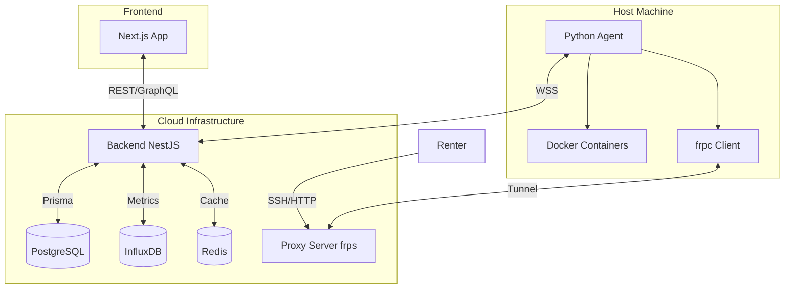

# Project Architecture & Technical Specifications: "DistributedCompute"

## 1. High-Level Architecture

The system consists of three main components interacting to provide a GPU/Compute rental marketplace.

| Component | Description |
|-----------|-------------|
| **Central Platform (Backend & Database)** | Orchestrates the market, handles payments, auth, and stores persistent data |
| **Web Frontend (Next.js)** | Interface for Renters (Marketplace) and Hosts (Fleet Management) |
| **Host Agent (Python)** | Runs on the provider's machine. Manages Docker containers, resources, and secure tunnels |



---

## 2. Monorepo Setup (Recommended)

> [!IMPORTANT]
> Initialize as a **Monorepo** (using Turborepo or Nx) to share TypeScript interfaces between Frontend and Backend. This ensures type safety—if the Backend changes an API response, the Frontend knows immediately via TypeScript errors.

### Project Structure

```
distributed-compute/
├── apps/
│   ├── backend/          # NestJS application
│   └── frontend/         # Next.js application
├── packages/
│   └── shared-types/     # Shared DTOs and interfaces
├── turbo.json            # Turborepo config
├── package.json          # Root workspace
└── pnpm-workspace.yaml   # pnpm workspaces
```

### Shared Types Package

The `packages/shared-types` package exports:
- API response interfaces
- WebSocket event types
- Entity DTOs
- Enums (Role, NodeStatus, RentalStatus, etc.)

```typescript
// packages/shared-types/src/index.ts
export * from './entities';
export * from './events';
export * from './api';
```

---

## 3. Development Order

> [!IMPORTANT]
> Start with the **Backend** first. You need the database schema and WebSocket gateway running before the Python Agent has anything to talk to.

### Recommended Sequence

1. **Backend** - Database schema, WebSocket gateway, core APIs
2. **Agent** - Hardware detection, Docker orchestration, tunnel integration
3. **Frontend** - Consume Backend APIs, build dashboard UIs

---

## 4. Critical Architectural Decisions

### Virtualization: Docker Containers (NOT VMs)

We use **Docker Containers** (OS-level virtualization), NOT VMs.

**Rationale**: 
- Lower overhead than KVM/QEMU
- Allows native GPU passthrough via **NVIDIA Container Toolkit**
- Near-native performance for AI workloads

### Connectivity: Reverse Proxy Tunneling (FRP)

We use a **Reverse Proxy Tunneling** approach using [FRP (Fast Reverse Proxy)](https://github.com/fatedier/frp).

> [!TIP]
> For the Proxy Server (the NAT solution), run **frps** (Server) on a cheap cloud VPS (DigitalOcean/Vultr) and bundle **frpc** (Client) inside the Python Agent.

**Architecture**:
```
Host Agent (Local) → Opens TCP Tunnel → Central Proxy Server (frps) → Renter connects via Public Port
```

**Benefit**: Hosts do not need to open router ports manually.

**Implementation**:

| Component | Location | Responsibility |
|-----------|----------|----------------|
| **frps** (Server) | Cloud VPS | Accept tunnel connections, route traffic to agents |
| **frpc** (Client) | Bundled in Agent | Create tunnels for each rental, map container ports |
| **Backend** | Cloud | Allocate/track public ports, manage tunnel lifecycle |

**Example Port Mapping**:
```
Public: proxy.yourdomain.com:10022 → Tunnel → Host:localhost:22 (SSH)
Public: proxy.yourdomain.com:10888 → Tunnel → Host:localhost:8888 (Jupyter)
```

### Telemetry

| Data Type | Storage | Rationale |
|-----------|---------|-----------|
| High-frequency metrics (CPU/GPU usage) | InfluxDB (Time-Series) | Optimized for time-series queries |
| State data (User, Balance, Config) | PostgreSQL (Relational) | ACID compliance, relational queries |

---

## 5. Communication Protocols

### A. Host Agent ↔ Backend (WebSocket)

The Agent maintains a persistent **Secure WebSocket (WSS)** connection to the Backend Gateway.

**Authentication**:
```
Handshake Header: Authorization: Bearer <HOST_API_KEY>
```

**Heartbeat Payload** (Every 5 seconds):
```json
{
  "event": "heartbeat",
  "data": {
    "node_id": "uuid-v4",
    "status": "online | busy | maintenance",
    "metrics": {
      "cpu_temp": 45.5,
      "gpu_temp": [60.0, 58.0],
      "gpu_utilization": [80, 10],
      "ram_usage_mb": 4096,
      "disk_usage_gb": 120
    }
  }
}
```

**Commands (Backend → Agent)**:

| Command | Purpose |
|---------|---------|
| `start_instance` | Start a Docker container for a rental |
| `stop_instance` | Gracefully stop a container |
| `drain_node` | Finish current jobs, accept no new ones |

**START_INSTANCE Payload**:
```json
{
  "event": "start_instance",
  "data": {
    "rental_id": "uuid",
    "image": "pytorch/pytorch:2.0.1-cuda11.7-cudnn8-runtime",
    "resource_limits": {
      "gpu_indices": ["0"],
      "cpu_cores": 4,
      "ram_limit": "16g"
    },
    "env_vars": {"JUPYTER_TOKEN": "xyz"},
    "proxy_port_mapping": { "22": 10022, "8888": 10888 }
  }
}
```

### B. Agent ↔ Proxy Server (Tunneling)

The Agent spawns a subprocess (`frpc`) to connect to the central Proxy Server.

**Flow**:
1. Backend allocates public ports for the rental
2. Backend sends `start_instance` with `proxy_port_mapping`
3. Agent starts container and creates FRP tunnel
4. Agent reports connection info back to Backend
5. Renter connects via `proxy.yourdomain.com:assigned_port`

---

## 6. Database Schema Strategy (Prisma/Postgres)

```prisma
model User {
  id        String   @id @default(uuid())
  clerkId   String   @unique
  email     String   @unique
  role      Role     @default(BOTH)  // RENT, LEASE, or BOTH
  balance   Decimal  @default(0)
}

model HostNode {
  id            String     @id @default(uuid())
  ownerId       String
  specs         Json       // GPU model, VRAM, CPU, RAM, disk
  pricingConfig Json       // hourly rates, smart pricing config
  status        NodeStatus
  locationData  Json?      // country, city, coordinates
}

model Rental {
  id             String       @id @default(uuid())
  renterId       String
  nodeId         String
  startTime      DateTime
  endTime        DateTime?
  costPerHour    Decimal
  containerId    String?
  connectionInfo Json?        // SSH string, proxy address, ports
  status         RentalStatus
}

model Transaction {
  id          String          @id @default(uuid())
  userId      String
  amount      Decimal
  type        TransactionType  // CREDIT or DEBIT
  referenceId String?          // rental_id or payment reference
}
```

> [!NOTE]
> **InfluxDB** is used exclusively for metrics data (CPU/GPU temps, utilization). Do NOT store high-frequency metrics in PostgreSQL—it will cause performance issues.

---

## 7. Security Standards

| Area | Standard |
|------|----------|
| **Agent Isolation** | Containers run with strict cgroups limits. Host filesystem NEVER mounted unless explicitly configured for cache |
| **API Security** | All HTTP endpoints require Clerk Authentication |
| **Tunnel Security** | SSH traffic is end-to-end encrypted. Proxy Server only forwards TCP packets |
| **Secrets** | No hardcoded keys. All sensitive data via `.env` |
| **Env Validation** | Validate `.env` schema on startup using `zod` or `joi` |

---

## 8. Deployment & Infrastructure

| Component | Deployment |
|-----------|------------|
| **Backend** | Dockerized NestJS app |
| **Frontend** | Vercel or Dockerized Next.js |
| **Databases** | Managed Postgres, InfluxDB, Redis |
| **Proxy Server** | Dedicated high-bandwidth VPS running frps |

### Docker Compose (Development)

```yaml
services:
  backend:
    build: ./apps/backend
    ports:
      - "3000:3000"
    depends_on:
      - postgres
      - influxdb
      - redis

  postgres:
    image: postgres:16
    environment:
      POSTGRES_DB: distributed_compute
      POSTGRES_USER: dev
      POSTGRES_PASSWORD: dev
    volumes:
      - postgres_data:/var/lib/postgresql/data

  influxdb:
    image: influxdb:2.7
    ports:
      - "8086:8086"
    volumes:
      - influxdb_data:/var/lib/influxdb2

  redis:
    image: redis:7-alpine
    ports:
      - "6379:6379"

volumes:
  postgres_data:
  influxdb_data:
```